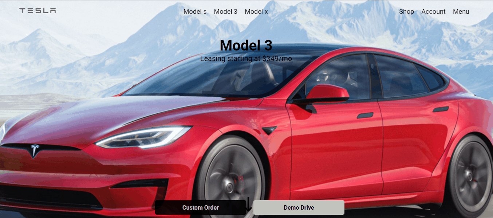

# Projeto Landing Page Tesla

Esse projeto é uma landing page do site Testa feito por mim para aplicar alguns conhecimentos de Html e Css. 🚀

---

[]

___

## Tecnologias utilizadas

- Html
- Css

___

## Como utilizar

```bash
#para clonar o projeto
$git clone  https://github.com/rickmotasantos/site-tesla.git

#para iniciar o projeto na sua máquina
$git init 
```

___

projeto Desenvolvido por Ricardo Mota 😁

___


<h1>
 <a href="https://rickmotasantos.github.io/site-tesla/">Acessar o projeto na Url</a>
</h1>